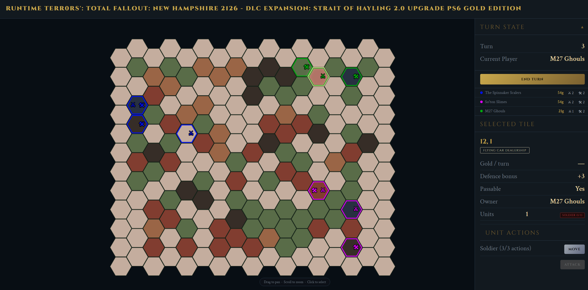

# HackPompey 2025 - Runtime Terr0rs': Total Fallout: New Hampshire 2126 - DLC Expansion: Strait of Hayling 2.0 Upgrade PS6 Gold Edition (Hampshire Wars 2126 for short)

A turn-based hotseat war simulation built at [HackPompey 2026](https://hackpompey.co.uk/), heavily inspired by Sid Meier's Civilization. The theme this year was 100 for celebrating Portsmouth's centenary as a city. We took that forward rather than back: welcome to Portsmouth, 2126.

100 years in the future, in the year 2126, wars will not be fought internationally but locally. When aliens finally touch down on what remains of the British Isles, and the nation is divided by regional factions, we will be fighting each other for resources. Now you can be ready for it...

## What We Built

Hampshire Wars 2126 is a modern warfare strategy game played on a hex grid map. Multiple factions battle for control in a turn-based hotseat format. One screen, one keyboard, one winner.

The game features everything you'd expect from a Civ-inspired title: hex-based unit movement, a combat system, resource management, and a proper win condition. 

The general strategy revolves around controlling high-value tiles, most notably the Alien Caverns (the aliens land in 2094, just so you're aware). Plant workers on those tiles and guard them with warriors to generate more warriors, then push out and invade your opponents.

Lose condition: an enemy warrior steps into your outpost. Don't let that happen.

## How to Play

Open `index.html` in your browser and you're good to go. No installation, no server, just a browser and two friends to destroy. Alternative, open the Git Pages link by clicking [here](https://runtime-terr0rs.github.io/hack-pompey-2026/)!

Players take turns on the same machine (hotseat style). Move your units across the hex grid, manage your resources, and eliminate the opposing faction to win.

## Built With

- HTML / CSS / JavaScript
- Canvas

## Future Work

- More unit types and faction variety
- Sound and music
- Animations and visual polish
- More map variety and procedural generation

## Closing Notes

Huge thanks to the HackPompey team for putting on another brilliant event. We as a group have been going for a while and always enjoy the time spent.

## Authors

- Ethan Egerton ([@ethan-egerton](https://github.com/ethan-egerton))
- Jack Ramsay ([@jramsay21](https://github.com/jramsay21))
- Oliver Goggins ([@OGoggins](https://github.com/OGoggins))
- Theo Kinder ([@Theoryia](https://github.com/Theoryia))